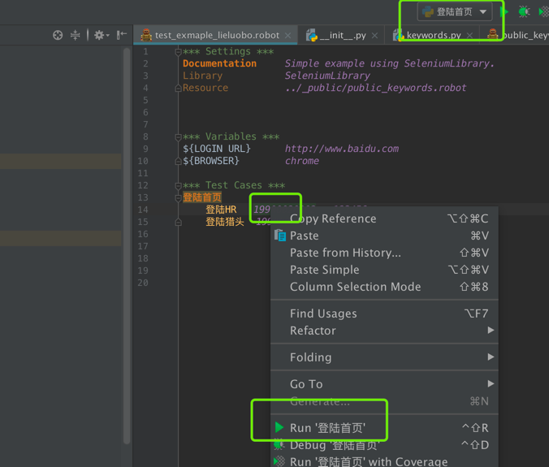

## build
   open idea, open this source, open Project Structure>SDKs, set IntelliJ Platform Plugin SDK, add python Libraries, set Artifacts, finally Build Artifacts.
   
## feature
- run robot framework from python
- can debug python library.( not support  debug *.robot file.)
## notice 
   not support run suite now.
## usage
   install plugin intellibot first
## preview

## change log
 - add *.robot support.
 
